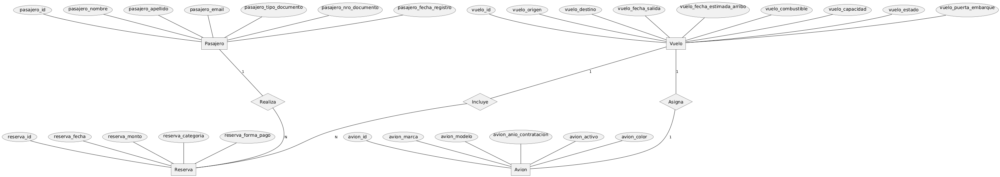

# TP1 - Base de Datos (Aerolinea_UI)

Este trabajo práctico implementa un modelo de base de datos relacional para la gestión de una aerolínea ficticia, siguiendo **principios de normalización** (hasta 3FN), **nombres de campos únicos** y **buenas prácticas de SQL**.

## 📂 Estructura de Archivos

| Archivo | Descripción |
|---------|-------------|
| `CreacionBdTablas_A1B2C3D4E5F64789A0B1C2D3E4F50607.sql` | Creación de la base de datos y tablas normalizadas con claves primarias y foráneas |
| `InsercionDatos_A1B2C3D4E5F64789A0B1C2D3E4F50607.sql` | Inserción de registros iniciales (únicos y múltiples) |
| `ModificacionTablas_A1B2C3D4E5F64789A0B1C2D3E4F50607.sql` | Alteraciones de estructura: agregar, modificar, eliminar y renombrar columnas |
| `UsuariosRoles_A1B2C3D4E5F64789A0B1C2D3E4F50607.sql` | Creación y gestión de usuarios y roles con permisos específicos |
| `ConsultasCondicionadas_A1B2C3D4E5F64789A0B1C2D3E4F50607.sql` | Consultas con `WHERE` y operadores lógicos |
| `ConsultasOrdenadas_A1B2C3D4E5F64789A0B1C2D3E4F50607.sql` | Consultas con `ORDER BY` |
| `ConsultasAgrupadas_A1B2C3D4E5F64789A0B1C2D3E4F50607.sql` | Consultas con `GROUP BY`, agregaciones y `HAVING` |
| `AbmDatos_A1B2C3D4E5F64789A0B1C2D3E4F50607.sql` | Operaciones de actualización y eliminación de registros |

---

## Diagrama



---

## Eliminar Usuarios y Roles

```sql
SELECT VERSION();
SHOW TABLES FROM mysql LIKE 'roles_mapping';

SELECT user, host FROM mysql.user WHERE user LIKE 'usuario_%';
SELECT * FROM mysql.roles_mapping WHERE TO_USER LIKE 'usuario_%';

-- Revocar roles de los usuarios
REVOKE 'rol_reserva_A1B2C3' FROM 'usuario_aerolinea_A1B2C3'@'%';
REVOKE 'rol_reserva_A1B2C3' FROM 'usuario_reserva_A1B2C3'@'%';

-- Revocar privilegios directos (opcional)
REVOKE ALL PRIVILEGES, GRANT OPTION FROM 'usuario_aerolinea_A1B2C3'@'%';
REVOKE ALL PRIVILEGES, GRANT OPTION FROM 'usuario_reserva_A1B2C3'@'%';
REVOKE ALL PRIVILEGES, GRANT OPTION FROM 'usuario_admin_A1B2C3'@'%';

-- Eliminar usuarios
DROP USER IF EXISTS 'usuario_aerolinea_A1B2C3'@'%';
DROP USER IF EXISTS 'usuario_reserva_A1B2C3'@'%';
DROP USER IF EXISTS 'usuario_admin_A1B2C3'@'%';

-- Eliminar rol
DROP ROLE IF EXISTS 'rol_reserva_A1B2C3';
```

## 🛠️ Requisitos Previos

- **Motor de base de datos**: MySQL 8.x o MariaDB 10.x  
- **Cliente SQL**: MySQL Workbench, DBeaver, línea de comandos o similar  
- Usuario con permisos para crear bases de datos y usuarios

---

## 🚀 Orden de Ejecución

1. **Crear la base de datos y tablas**  
   ```bash
   SOURCE 01_creacion_bd_tablas.sql;
   ```

2. **Insertar datos iniciales**  
   ```bash
   SOURCE 02_insercion_datos.sql;
   ```

3. **Aplicar modificaciones de estructura**  
   ```bash
   SOURCE 03_modificacion_tablas.sql;
   ```

4. **Configurar usuarios y roles**  
   ```bash
   SOURCE 04_usuarios_roles.sql;
   ```

5. **Ejecutar consultas de prueba**  
   ```bash
   SOURCE 05_consultas_condicionadas.sql;
   SOURCE 06_consultas_ordenadas.sql;
   SOURCE 07_consultas_agrupadas.sql;
   ```

6. **Probar operaciones de actualización y eliminación**  
   ```bash
   SOURCE 08_abm_datos.sql;
   ```

---

## 📐 Principios Aplicados

- **Nombres de campos únicos**: cada columna incluye un prefijo con el nombre de la tabla para evitar ambigüedades en `JOIN`.
- **Integridad referencial**: uso de claves foráneas (`FOREIGN KEY`) para mantener consistencia entre tablas.
- **Normalización**:  
  - **1FN**: datos atómicos, sin listas o valores repetidos en una celda.  
  - **2FN**: eliminación de dependencias parciales en claves compuestas.  
  - **3FN**: eliminación de dependencias transitivas.
- **Seguridad**: separación de usuarios con permisos limitados y roles específicos.
- **Escalabilidad**: tipos de datos y restricciones pensados para crecimiento futuro.

---

## 📄 Notas

- Los scripts están diseñados para ejecutarse en orden, pero pueden adaptarse a otros SGBD con cambios mínimos.
- Las fechas y valores de ejemplo son ficticios y pueden modificarse para pruebas adicionales.
- El nombre de la base de datos incluye sufijo `_ui` por las dos últimas letras del apellido del autor.

---

## ✍️ Autor

**Usui, José Fernando**  
Universidad de la Cuenca del Plata  
Materia: Base de Datos

---